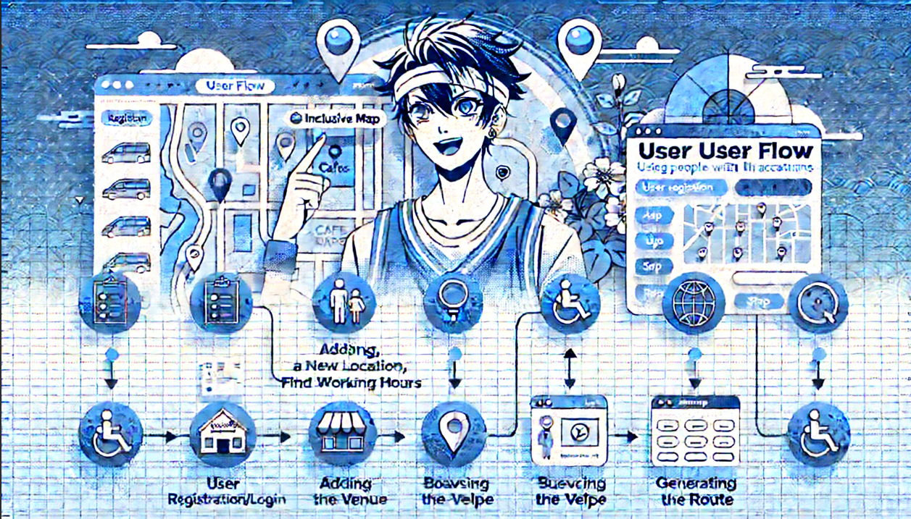

<strong>InclusiveMap</strong> is a  full-stack web application designed to help users quickly locate accessible spaces in urban environments.
on backend it is using microservices architecture with modern AI solutins to validate esteblishments with their access level  using modern frameworks as Django Rest Framework, Django Ninja and FastAPI to handle frontend communication. While fronend side is based on Material-UI.


## Getting Started
First, run the backend server:

```bash
cd backend
make up-all-no-cache-without-monitoring
```

Then checkout [localhost](http://localhost/api/swagger/) for drf swagger
Or [localhost](http://localhost/api/v1/ninja/docs) for django ninja swagger


Run frontend
```bash
cd frontend
make up
```
or you could check it on [rakvzan](https://rakvzan.space/)

[figma link](https://www.figma.com/design/I6EbpelFsat54aXF4JiG33/InclusiveMap?node-id=0-1&p=f)


# Adjustement
***dont forget to setup .env files in backend/ and frontend/ dirs for local run***

***also some endpoints are returning verification codesin case if emails sending wont work***

<br>
<p align="center" style="text-align: center;">
  
</p>